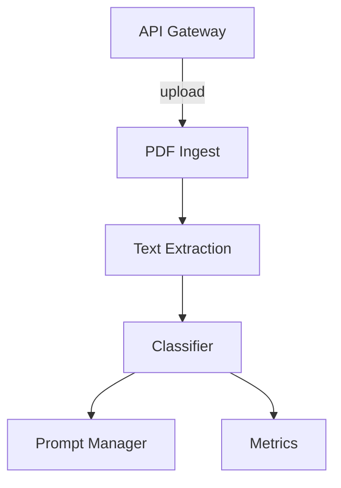

# Regress

Microservice system for PDF classification using Rust.
For a German overview, see [docs/PROJECT_DOC_DE.md](docs/PROJECT_DOC_DE.md).




## Building

The `text-extraction` service depends on the native
Tesseract OCR library. When building on Windows, install
both **leptonica** and **tesseract** via `vcpkg`:

```powershell
vcpkg install leptonica:x64-windows-static-md \
               tesseract:x64-windows-static-md
```

The CI workflow installs these packages automatically.

## Configuration

All services read the database connection string from the `DATABASE_URL` environment variable.
Kafka connection is read from `MESSAGE_BROKER_URL`.
If either variable is omitted, the code falls back to `host=regress-db-develop.postgres.database.azure.com port=5432 dbname=allianz user=regressdb@regress-db-develop password=cu5u.AVC?9055l sslmode=require` and `kafka:9092` respectively.
When running the services outside of Docker you must set `DATABASE_URL` to the Azure server:

```bash
export DATABASE_URL="host=regress-db-develop.postgres.database.azure.com port=5432 dbname=allianz user=regressdb@regress-db-develop password=cu5u.AVC?9055l sslmode=require"
```
To connect to an Azure Database for PostgreSQL Flexible Server, provide the full connection string via `DATABASE_URL`. Example:

```bash
export DATABASE_URL="host=regress-db-develop.postgres.database.azure.com \
  port=5432 dbname=allianz user=regressdb@regress-db-develop \
  password=<YOUR_PASSWORD> sslmode=require"
```
Failure to connect to the database results in `500 Internal Server Error`
responses when accessing `/prompts`.
The classifier additionally requires `OPENAI_API_KEY` and uses `CLASS_PROMPT_ID` to select a prompt.
If the id is zero or the row is missing, the service falls back to a built-in
prompt so classification still works.
Defaults are provided in `docker-compose.yml`. The metrics service reads from the same database.

## Usage

1. Upload a PDF via `POST http://localhost:8081/upload` with a multipart field
   named `file`. The response contains the generated id.
2. The `text-extraction` service processes the file asynchronously and publishes
   a `text-extracted` event.
3. The `classifier` consumes that event, calls OpenAI and stores the result in
   the `classifications` table. Poll `GET http://localhost:8084/results/{id}`
   until data is returned. The endpoint returns `202 Accepted` while the
   classification is still pending. If the OpenAI request fails the endpoint
   returns `500` with an `error` field describing the problem.
4. To re-run classification on already extracted texts, first fetch available
   ids via `GET http://localhost:8083/texts` and then submit them to
   `POST http://localhost:8083/analyze` together with a prompt. The endpoint does
   not repeat OCR but simply republishes a `text-extracted` event to start
   classification again.

The `prompt-manager` reads the database connection string from `DATABASE_URL`.
If the variable is not supplied it defaults to
`host=regress-db-develop.postgres.database.azure.com port=5432 dbname=allianz user=regressdb@regress-db-develop password=cu5u.AVC?9055l sslmode=require`.
`/prompts` exposes all stored prompts and the table is created automatically if
it does not exist.

## Running with Docker

Build and start all services, including the frontend, via Docker Compose:

```bash
docker compose up --build
```

1. Ensure Docker and Docker Compose are installed.
2. Run `docker compose up --build` to build all images and start the services.
3. Access the frontend at <http://localhost:3000>.
4. Metrics are available at <http://localhost:8085/metrics>.
5. History service runs at <http://localhost:8090>.
6. Kafka UI is accessible at <http://localhost:8086> for browsing topics and viewing messages.

After the build completes, open <http://localhost:3000> in your browser to use the application.

The frontend expects three environment variables:
`VITE_INGEST_URL` for the upload service (defaults to `http://localhost:8081`),
`VITE_CLASSIFIER_URL` for the classifier service (defaults to
`http://localhost:8084`), and `VITE_HISTORY_WS` for the history WebSocket
(defaults to `ws://localhost:8090`).

