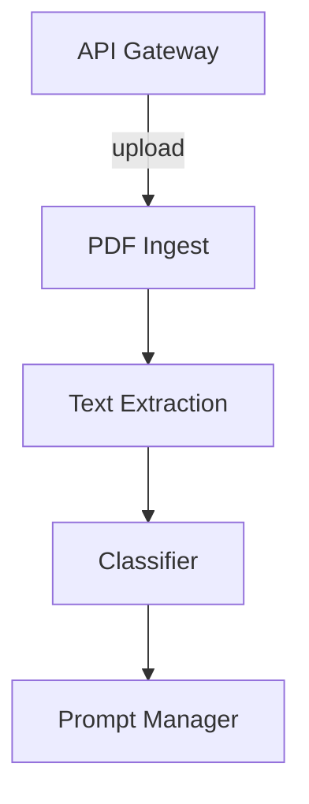

# Regress

Microservice system for PDF classification using Rust.



## Building

The `text-extraction` service depends on the native
Tesseract OCR library. When building on Windows, install
both **leptonica** and **tesseract** via `vcpkg`:

```powershell
vcpkg install leptonica:x64-windows-static-md \
               tesseract:x64-windows-static-md
```

The CI workflow installs these packages automatically.

## Usage

`text-extraction` starts an HTTP service on port `8083`. Send a `POST` request
to `/extract` with a JSON body `{ "path": "<pdf path>" }` to receive the
extracted text. The `classifier` expects an `OPENAI_API_KEY` environment
variable.

The `prompt-manager` reads the database connection string from `DATABASE_URL`.
If the variable is not supplied it defaults to
`postgres://postgres:postgres@db:5432/regress`.
`/prompts` exposes all stored prompts and the table is created automatically if
it does not exist.

## Running with Docker

Build and start all services, including the frontend, via Docker Compose:

```bash
docker compose up --build
```

After the build completes, open <http://localhost:3000> in your browser to view the dashboard.

